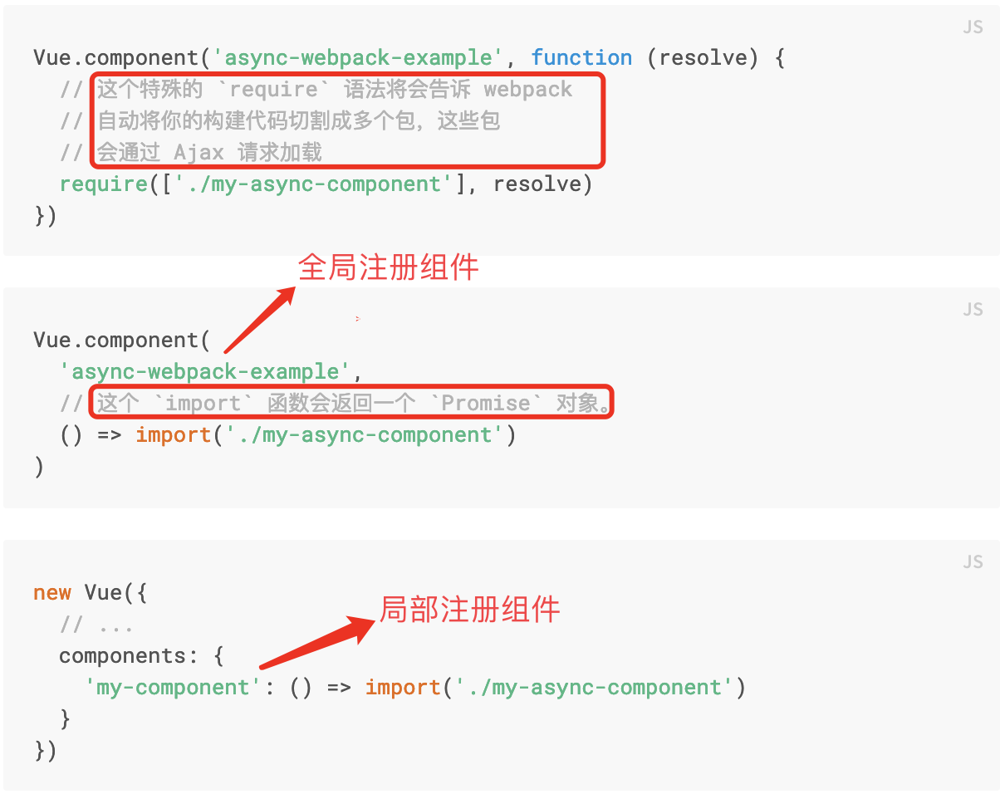
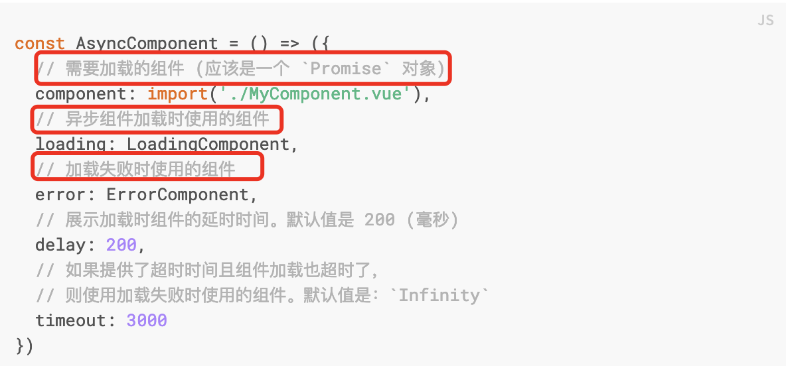
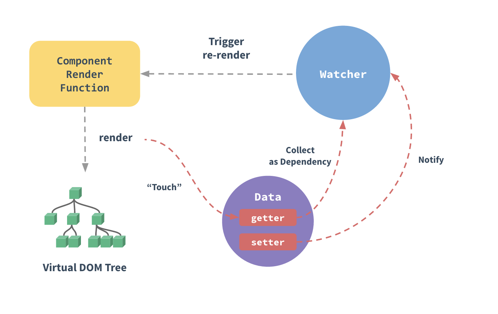

# vue_advanced

the basic practice of vue app

1. 模版语法

    Vue 将模板编译成虚拟 DOM 渲染函数。结合响应系统，Vue 能够智能地计算出最少需要重新渲染多少组件，并把 DOM 操作次数减到最少。

1.1 插值表达式

1.2 关于修饰符
修饰符 (Modifiers) 是以半角句号 . 指明的特殊后缀，用于指出一个指令应该以特殊方式绑定;
.prevent 修饰符告诉 v-on 指令对于触发的事件调用 event.preventDefault():

```javascript
    <form v-on:submit.prevent="onSubmit">...</form>
```

1.3计算属性vs模版方法vs侦听属性

计算属性是基于依赖进行缓存的，如果依赖值没有发生变化，不会去执行计算属性对应的getter函数；

模版方法在每次触发重新渲染时，都会执行;

侦听属性： Vue 通过 watch 选项提供了一个更通用的方法，来响应数据的变化。当需要在数据变化时执行异步或开销较大的操作时，这个方式是最有用的。

1.4 Class 与 Style 绑定

v-bind:class 指令也可以与普通的 class 属性共存, 支持字符串，对象和数组;

1.5 事件绑定以及修饰符

1.5.2 自定义事件
(1) 事件名
推荐使用kebab-case的事件名，大小写不敏感（dom模版会把事件名转为小写）；

(2) 将原生事件绑定到组件
;

1.5.3 程序化的事件监听

1.6 表单输入绑定
通过v-model 指令在表单元素上创建双向数据绑定；

v-model 会忽略所有表单元素的 value、checked、selected 特性的初始值而总是将 Vue 实例的数据作为数据来源；

2 深入理解组件

2.1 插槽

(1) 定义
插槽是vue中提供的内容分发API, 这套规范是基于web components的, <slot>元素作为内容载体；
(2) 命名插槽
(3) 插槽默认值
(4) 编译作用域
  父组件模板的所有东西都会在父级作用域内编译；子组件模板的所有东西都会在子级作用域内编译。
(5) 作用域插槽
  将父组件模版內的数据回传给子组件模版；(插槽prop))
  ;

2.2 处理边界条件

(1) 通过ref访问组件实例
(2) 依赖注入
  依赖注入是有副作用的。它将你的应用以目前的组件组织方式耦合了起来，使重构变得更加困难, 同时所提供属性是非响应式的;

[依赖注入实例](./src/images/vue-inject.png);

(3) 组件的递归调用（循环引用）

[组件的递归调用](./src/images/vue-circle.png);

组件的递归调用的结果是A和B组件相互依赖，从而无论先定义那个组件，另一个组件可能还未定义；这个问题在组件为全局注册的时候会自动帮我们解决，当局部定义组件的时候，我们可能需要异步解析的方法解决这个问题，就是A依赖B，但是我们不需要立即去解析B组件;

[组件的递归调用注意](./src/images/vue-circle-async.png);

(4) 内联模版(感觉用途不大，并且使得模版作用域变得更加复杂)
  当inline-template 这个特殊的特性出现在一个子组件上时，这个组件将会使用其里面的内容作为模板，而不是将其作为被分发的内容。

2.3 动态组件

(1) 使用
  通过<component>元素加一个特殊的is特性来实现; 与条件渲染相比，动态组件代码更加的优雅，特别是存在大量条件判断时候；

(2) keep-alive
  组件切换的时候，可以保持组件的状态，对性能提升有很大帮助；
  [具体详情见文档](https://cn.vuejs.org/v2/api/#keep-alive)

2.4 组件注册
全局注册：
Vue.component('my-component-name', {
  // ... 选项 ...
})
注意： 全局注册的行为必须在根 Vue 实例 (通过 new Vue) 创建之前发生；

局部注册：
var ComponentA = { /* ... */ }
new Vue({
  el: '#app',
  components: {
    'component-a': ComponentA,
    'component-b': ComponentB
  }
})


[业务组件局部注册，基础组件全局注册的最佳实践:](https://github.com/chrisvfritz/vue-enterprise-boilerplate/blob/master/src/components/_globals.js)

2.5 组件的属性(props)
属性值的验证（主要用于开发环境）;
属性值的替换和合并：class和style一般会合并，其它特性往往会替换；
;
禁用特性继承:通过inheritAttrs: false 和 $attrs，你就可以手动决定这些特性会被赋予哪个元素。

2.6 关于v-model
(1) v-model与表单元素
开发者可以很方便的通过v-model指令在表单元素input, textarea 以及select上创建数据的双向绑定；
本质上说它是语法糖，会根据元素类型选取正确的方法更新元素,除了radio，checkbox以及select等外，默认情况下，v-model的值会与表单元素的value绑定，并且在触发input事件时自动更新，从而实现双向绑定;对于上面几个特例，vue提供了组件model选项（2.2.0+以上）来自定义v-model的值绑定的属性以及更新的事件；

;
;

(2) v-model与自定义组件的v-model;

2.7 异步组件
  主要作用是模块的按需加载；为了实现代码分割，按需加载的功能，Vue允许你以一个工厂函数的方式异步解析你的组件定义，只有当组件需要被渲染的时候，才去加载组件；

;
;

3 过渡&动画
  vue在增加，删除和修改dom时，提供了不同应用动画的机制；

3.1 单元素和组件的过渡

  通过transition封装组件可以很方便为元素或者组件提供过渡动画；当插入或删除包含在transition组件中的元素时，Vue将会做以下特殊处理：如果目标元素包含了css过渡或者动画，在恰当的时间删除或添加css类名; 如果过渡组件提供了js钩子函数，钩子函数会在恰当的时机执行；既没有css类名和js钩子函数，dom操作会在下一帧立即执行;

(1) 过渡类名(详情见文档)
(2) css过渡和动画
(3) 自定义过渡类名
(4) js钩子函数
**Note**: 当只用JavaScript过渡的时候，在enter和leave中必须使用done进行回调。否则，它们将被同步调用，过渡会立即完成。推荐对于仅使用 JavaScript 过渡的元素添加 v-bind:css="false"，Vue 会跳过 CSS 的检测。这也可以避免过渡过程中 CSS 的影响。
(5) 初始渲染的过渡(appear)
(6) 过渡模式（mode）
**Note**: 对于多组件的过渡，一个离开过渡的时候另一个开始进入过渡。这是 <transition> 的默认行为 - 进入和离开同时发生;
(7) 多个组件的过渡
多个组件的过渡简单很多 - 我们不需要使用 key 特性。相反，我们只需要使用动态组件；

3.2 列表过渡

  上面提到的场景都是同一时间只渲染一个节点的场景，对于同时渲染多个节点的场景（列表），应该使用<transition-group>组件，它的特点在于：（1）它会以一个真实元素呈现：默认为一个 <span>。你也可以通过 tag 特性更换为其他元素。（2）过渡模式不可用。（3）内部元素需要提供唯一key。

(1) 进入/离开过渡
(2) 定位位置过渡（v-move）
(3) 列表交错过渡

3.3 可复用的过渡

3.4 动态过渡

3.5 状态过渡（针对元素本身状态值的过渡--eg属性值，颜色，大小等等）

4.可复用和组件

4.1 mixin(vue推荐的组件复用方式，可以对比一下hoc)

(1) 混入对象可以包含任何组件选项；

```javascript
  // 定义一个混入对象
  var myMixin = {
    created: function () {
      this.hello()
    },
    methods: {
      hello: function () {
        console.log('hello from mixin!')
      }
    }
  }

  // 定义一个使用混入对象的组件
  var Component = Vue.extend({
    mixins: [myMixin]
  })

  var component = new Component() // => "hello from mixin!"
```

(2) 混人对象和组件选项的合并
   合并规则可以分为三种情况：数据项，值为函数的项以及值为对象的项；

(3) 全局混入
  使用全局混入对象，将会影响到所有之后创建的Vue实例；大多数情况下，只应当应用于自定义选项。也可以将其用作Plugins以避免产生重复应用

```javascript
  // 为自定义的选项 'myOption' 注入一个处理器。
  Vue.mixin({
    created: function () {
      var myOption = this.$options.myOption
      if (myOption) {
        console.log(myOption)
      }
    }
  })

  new Vue({
    myOption: 'hello!' //自定义选项
  })
  // => "hello!"
```

(4) 自定义选项的合并策略

  自定义选项将使用默认策略，即简单地覆盖已有值。如果想让自定义选项以自定义逻辑合并，可以向Vue.config.optionMergeStrategies 添加一个函数;

4.2 自定义指令

(1) 注册全局或者局部指令

```javascript
  // 注册一个全局自定义指令 `v-focus`
  Vue.directive('focus', {
    // 当被绑定的元素插入到 DOM 中时……
    inserted: function (el) {
      // 聚焦元素
      el.focus()
    }
  })
  //directives是组件选项
  directives: {
    focus: {
      // 指令的定义
      inserted: function (el) {
        el.focus()
      }
    }
  }
  // to use
  <input v-focus>
```

(2) 指令对象中的钩子函数及对应的参数
  主要包括bind,unbind, update, componentupdate和inserted; 钩子函数参数包括el, binding, vnode和oldVnode(只有update相关的两个钩子函数包含这一参数)

4.3 渲染函数和jsx
(1) 渲染函数和template
    大多数情况下，使用模版是更好的选择（模版的特点是更加的直观，可读性好，书写也比较方便），但在需要完全js编程了简化代码的场景，可以使用渲染函数；

(2) 虚拟dom
  “虚拟 DOM”是我们对由Vue组件树建立起来的整个VNode树的称呼, 通过构建虚拟dom, 然后映射为真时dom。

(3) 渲染函数支持jsx
  [jsx语法](https://github.com/vuejs/jsx#installation)

(4) 函数式组件
  函数式组件的开销低，作为包装组件非常有用；
**note**: 函数式组件是无状态的，它没有实例；为了弥补函数式组件缺少的实例，渲染函数提供了上下文对象作为其第二个参数；

4.4 插件
  插件通常会为Vue添加全局功能, 通过全局方法Vue.use()使用插件,它需要在你调用 new Vue() 启动应用之前完成。

```javascript
    MyPlugin.install = function (Vue, options) {
      // 1. 添加全局方法或属性
      Vue.myGlobalMethod = function () {
        // 逻辑...
      }

      // 2. 添加全局资源
      Vue.directive('my-directive', {
        bind (el, binding, vnode, oldVnode) {
          // 逻辑...
        }
        ...
      })

      // 3. 注入组件
      Vue.mixin({
        created: function () {
          // 逻辑...
        }
        ...
      })

      // 4. 添加实例方法
      Vue.prototype.$myMethod = function (methodOptions) {
        // 逻辑...
      }
  }
```

**note**: [更多插件问题详情问题参考社区插件集合](https://github.com/vuejs/awesome-vue)

4.5 过滤器

  Vue.js允许你自定义过滤器，常用于的文本格式化。过滤器可以用在两个地方：双花括号插值和 v-bind 表达式 (后者从 2.1.0+ 开始支持)

5 工具

5.1 单文件组件
  更加方便组件的构建，并且支持第三方构建工具预处理；可读性更好，更适合构建大型项目；

5.2 单元测试
  
5.3 typescript支持

5.4 生产环境部署

(1) 模版预编译

  当使用 DOM 内模板或 JavaScript 内的字符串模板时，模板会在运行时被编译为渲染函数, 这对于性能要求很高的应用显然还不够， 使用单文件组件可以
在预编译的时候把模版编译成渲染函数；

(2) 提取组件的css

  当使用单文件组件时，组件内的 CSS 会以 <style> 标签的方式通过 JavaScript 动态注入。这有一些小小的运行时开销，如果你使用服务端渲染，这会导致一段“无样式内容闪烁 (fouc)”。将所有组件的 CSS 提取到同一个文件可以避免这个问题，也会让 CSS 更好地进行压缩和缓存。

(3) 跟踪运行时错误

  如果在组件渲染时出现运行错误，错误将会被传递至全局 Vue.config.errorHandler 配置函数 (如果已设置)。利用这个钩子函数来配合错误跟踪服务是个不错的主意。比如Sentry。

6 规模化

6.1 路由

(1) 通过history api自己实现路由;
(2) vue-router;
(3) 第三方路由（eg、Page.js)

6.2 状态管理

(1) vuex

6.3 服务端渲染

(1) [ssr](https://ssr.vuejs.org/zh/)
(2) [nuxt](https://nuxtjs.org/)
(3) [Quasar Framework SSR + PWA](https://quasar-framework.org/)

6.4 深入响应式原理

;