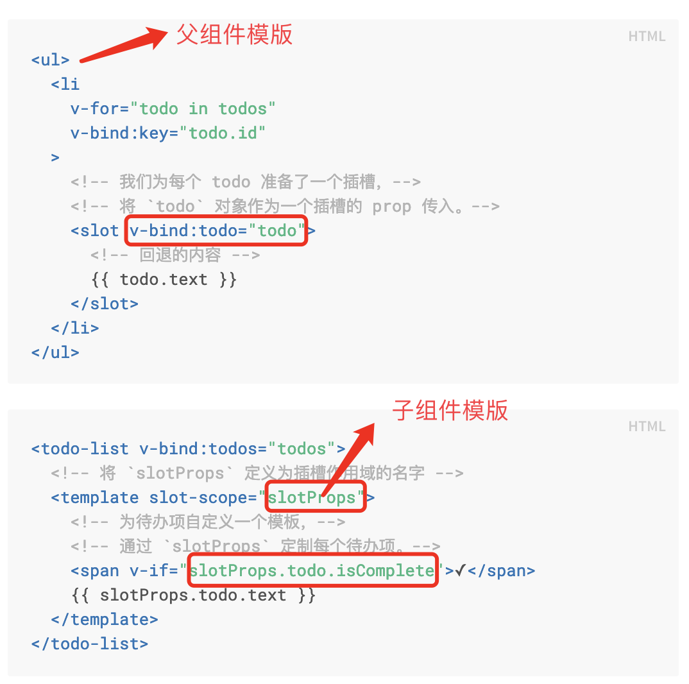
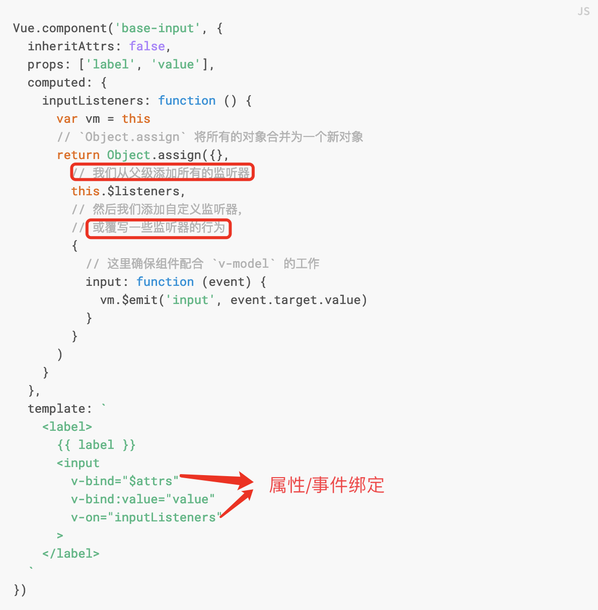
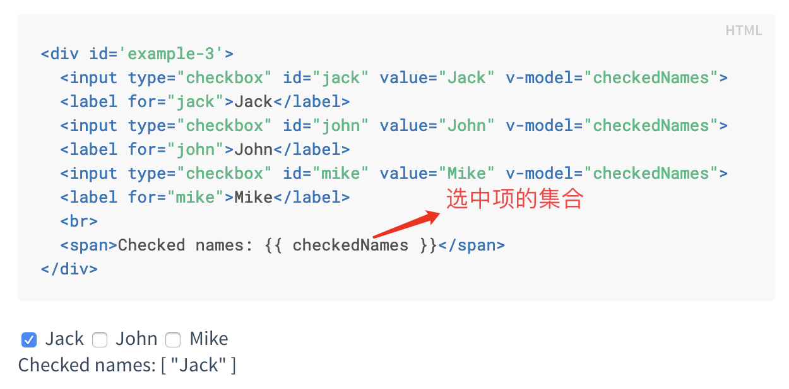
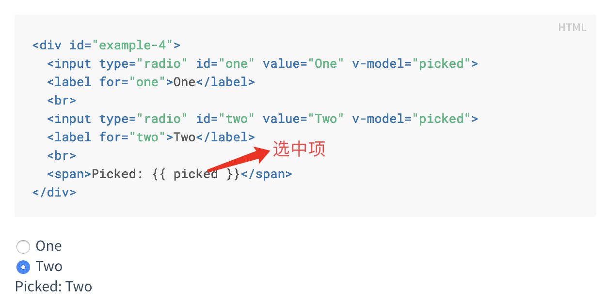

# vue_advanced

the basic practice of vue app

1. 模版语法

    Vue 将模板编译成虚拟 DOM 渲染函数。结合响应系统，Vue 能够智能地计算出最少需要重新渲染多少组件，并把 DOM 操作次数减到最少。

1.1 插值表达式

1.2 关于修饰符
修饰符 (Modifiers) 是以半角句号 . 指明的特殊后缀，用于指出一个指令应该以特殊方式绑定;
.prevent 修饰符告诉 v-on 指令对于触发的事件调用 event.preventDefault():

```javascript
    <form v-on:submit.prevent="onSubmit">...</form>
```

1.3计算属性vs模版方法vs侦听属性

计算属性是基于依赖进行缓存的，如果依赖值没有发生变化，不会去执行计算属性对应的getter函数；

模版方法在每次触发重新渲染时，都会执行;

侦听属性： Vue 通过 watch 选项提供了一个更通用的方法，来响应数据的变化。当需要在数据变化时执行异步或开销较大的操作时，这个方式是最有用的。

1.4 Class 与 Style 绑定

v-bind:class 指令也可以与普通的 class 属性共存, 支持字符串，对象和数组;

1.5 事件绑定以及修饰符

1.6 表单输入绑定
通过v-model 指令在表单元素上创建双向数据绑定；

v-model 会忽略所有表单元素的 value、checked、selected 特性的初始值而总是将 Vue 实例的数据作为数据来源；

2 深入理解组件

2.1 插槽

(1) 定义
插槽是vue中提供的内容分发API, 这套规范是基于web components的, <slot>元素作为内容载体；
(2) 命名插槽
(3) 插槽默认值
(4) 编译作用域
  父组件模板的所有东西都会在父级作用域内编译；子组件模板的所有东西都会在子级作用域内编译。
(5) 作用域插槽
  将父组件模版內的数据回传给子组件模版；
  ;

2.2 自定义组件

2.3 动态组件

(1) 使用
  通过<component>元素加一个特殊的is特性来实现; 与条件渲染相比，动态组件代码更加的优雅，特别是存在大量条件判断时候；

(2) keep-alive
  组件切换的时候，可以保持组件的状态，对性能提升有很大帮助；
  [具体详情见文档](https://cn.vuejs.org/v2/api/#keep-alive)

2.4 组件注册
全局注册：
Vue.component('my-component-name', {
  // ... 选项 ...
})
注意： 全局注册的行为必须在根 Vue 实例 (通过 new Vue) 创建之前发生；

局部注册：
var ComponentA = { /* ... */ }
new Vue({
  el: '#app',
  components: {
    'component-a': ComponentA,
    'component-b': ComponentB
  }
})


[业务组件局部注册，基础组件全局注册的最佳实践:](https://github.com/chrisvfritz/vue-enterprise-boilerplate/blob/master/src/components/_globals.js)

2.5 组件的属性(props)
属性值的验证（主要用于开发环境）;
属性值的替换和合并：class和style一般会合并，其它特性往往会替换；
;
禁用特性继承:通过inheritAttrs: false 和 $attrs，你就可以手动决定这些特性会被赋予哪个元素。

2.6 自定义事件
(1) 事件名
推荐使用kebab-case的事件名，大小写不敏感（dom模版会把事件名转为小写）；

(2) 将原生事件绑定到组件
;

2.7 关于v-model
(1) v-model与表单元素
开发者可以很方便的通过v-model指令在表单元素input, textarea 以及select上创建数据的双向绑定；
本质上说它是语法糖，会根据元素类型选取正确的方法更新元素,除了radio，checkbox以及select等外，默认情况下，v-model的值会与表单元素的value绑定，并且在触发input事件时自动更新，从而实现双向绑定;对于上面几个特例，vue提供了组件model选项（2.2.0+以上）来自定义v-model的值绑定的属性以及更新的事件；

;
;

(2) v-model与自定义组件的v-model;

2.8 异步组件

3 过渡&动画